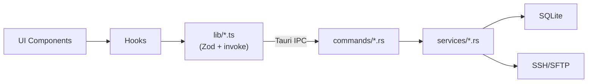

# CLAUDE.md

TunnelFiles — Cross-platform desktop SSH/SFTP file manager.
Tauri 2 (Rust) · React 19 · TypeScript · TailwindCSS 4 · shadcn/ui · TanStack Query · Zustand · xterm.js

## Commands

```bash
pnpm tauri dev                           # Full dev environment
pnpm lint && pnpm format:check           # Frontend quality check
pnpm test:run                            # Frontend tests (Vitest)
cd src-tauri && cargo test --lib --bins   # Backend tests
pnpm generate:types                      # Regenerate TS bindings from Rust (ts-rs)
```

Before committing: `pnpm lint && pnpm format:check && pnpm test:run`

Commit format: `type(scope): description` — types: feat|fix|refactor|style|docs|test|chore

## Architecture



New feature build order: Types → Rust commands → lib/ wrappers → hooks → UI components

### Routes

| Path                | Page            | Purpose                                   |
| ------------------- | --------------- | ----------------------------------------- |
| `/connections`      | ConnectionsPage | Profile list, create/edit/delete, connect |
| `/files/:sessionId` | FileManagerPage | File browser + terminal (tabbed)          |
| `/settings`         | SettingsPage    | App configuration                         |

### Frontend (`src/`)

| Directory               | Role                                                        |
| ----------------------- | ----------------------------------------------------------- |
| `pages/`                | Route-level components (lazy loaded)                        |
| `components/{feature}/` | Colocated feature components                                |
| `components/ui/`        | shadcn/ui primitives only                                   |
| `hooks/`                | Shared React hooks                                          |
| `stores/`               | Zustand stores (useTransferStore)                           |
| `lib/`                  | IPC wrappers — all `invoke()` goes through here             |
| `types/`                | Hand-written types + `bindings/` (auto-generated via ts-rs) |

### Backend (`src-tauri/src/`)

| Directory   | Role                                                                                     |
| ----------- | ---------------------------------------------------------------------------------------- |
| `commands/` | IPC entry points (`#[tauri::command]`)                                                   |
| `services/` | Business logic — SessionManager, SftpService, TerminalManager, TransferManager, Database |
| `models/`   | Data structs — Profile, FileEntry, Settings, TransferTask, AppError                      |
| `utils/`    | path_security, logging                                                                   |

## Key Patterns

- **IPC contract**: All frontend calls go through `src/lib/*.ts` wrappers — direct `invoke()` forbidden. Rust commands return `AppResult<T>`.
- **State management**: TanStack Query for server data (files, profiles, settings) · Zustand for real-time UI (transfer progress) · useState for component-local state.
- **Type safety**: Rust structs generate `src/types/bindings/` via ts-rs (`pnpm generate:types`). `binding-checks.ts` validates hand-written types against generated ones at `tsc --noEmit` time.
- **Error handling**: Structured `AppError` + `ErrorCode` enum. Frontend dispatches recovery via `handleErrorByCode()`.
- **SSH isolation**: SFTP uses the main session's channel. Each terminal instance creates a separate SSH session.

## Quality Gates

- New functions, hooks, or components: implementation plan MUST include a test plan section.
- Bug fixes: MUST include a regression test covering the fixed scenario.

## CI

- **Frontend**: lint → format → tsc --noEmit → vitest (coverage)
- **Backend**: cargo fmt → clippy → cargo test
- **E2E**: WebKitWebDriver + Docker SSH test servers + visual regression
- **Security**: dependency audit

## Design

@.impeccable.md
