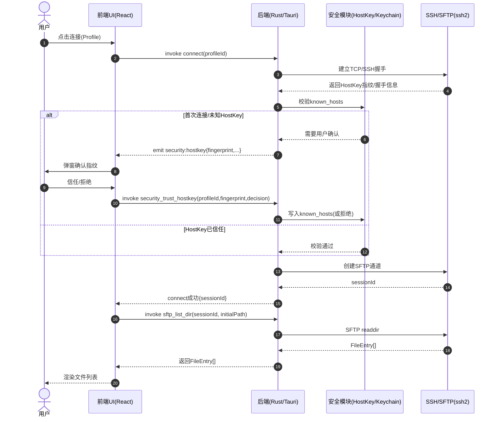
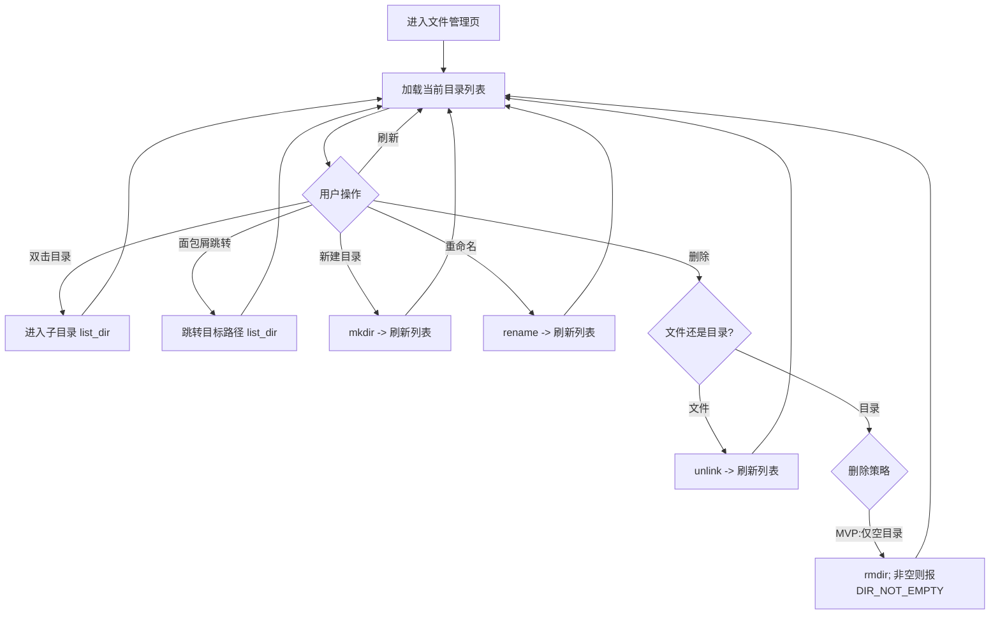
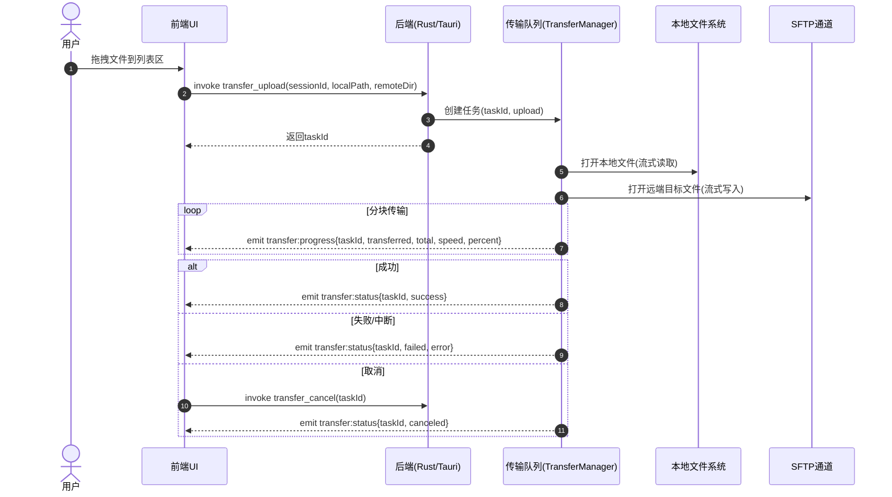

# 系统架构设计文档

**设计目标**
1. 统一架构视图：明确边界、目标与非目标，补齐“端到端业务流”。  
2. 组件化分层：按 Frontend / IPC / Backend / Storage / Security 拆分职责与依赖。  
3. 标准化接口：给出可直接落地的 Commands（请求-响应）与 Events（推送）清单与数据模型。  
4. 强化数据流与存储：明确 SQLite/JSON/Keychain 的数据归属、迁移与一致性策略。  
5. 完善部署与运维：补齐打包发布、自动更新、日志与诊断、测试策略。  
6. 异常与安全体系：覆盖认证、HostKey、网络、传输中断、权限、磁盘等场景的处理闭环。  

---

## 一、系统概述
本系统为**跨平台桌面 SSH/SFTP 可视化文件管理客户端**（macOS 优先，兼容 Windows/Linux），提供：
- SSH 连接与认证（密码 / SSH Key）
- SFTP 文件浏览与操作（列表、排序、创建目录、重命名、删除）
- 拖拽上传与下载、任务队列、进度反馈、取消/重试
- 安全机制（HostKey/known_hosts、凭据安全存储）
- 本地持久化（连接配置、偏好设置、任务记录）

技术路线：**Tauri 2 + Rust（后端） + React/TypeScript（前端）**。前端负责交互与展示，后端负责网络连接、文件传输、队列调度与系统能力调用，通过 Tauri IPC（invoke + event）通信。

---

## 二、业务流程
> 说明：以下流程以 Mermaid 表达，便于研发直接转为时序/流程实现。

### 2.1 连接与 HostKey 校验（时序图）


### 2.2 文件浏览与操作（流程图）


### 2.3 上传/下载与队列（时序图）


---

## 三、系统组件
- **前端 UI（React + TS）**：页面（连接管理/连接表单/文件管理/设置/任务中心）、拖拽交互、右键菜单、进度展示、错误提示与引导。
  - **页面路由**：
    - `/connections` - 连接列表页
    - `/connections/new` - 新增连接页
    - `/connections/:id/edit` - 编辑连接页
    - `/files/:sessionId` - 文件管理页
    - `/settings` - 设置页
- **状态与数据层**：
  - **TanStack Query**：管理服务端状态（profiles、files 列表等请求-响应数据）
  - **Zustand**：管理客户端状态（传输任务队列、实时进度等高频更新的本地状态）  
- **IPC 网关（Tauri invoke/event）**：前端调用后端命令、后端向前端推送事件；负责序列化与权限边界。  
- **会话管理 SessionManager（Rust）**：创建/维护/回收 SSH Session 与 SFTP Channel；支持多会话（为多 Tab 预留）。  
- **SFTP 服务 SftpService（Rust）**：封装 list/stat/mkdir/rename/delete 上传下载的底层调用；统一错误码与重试建议。  
- **传输队列 TransferManager（Rust + tokio）**：任务状态机、并发控制、取消、重试、进度统计、事件推送。  
- **安全模块 SecurityService（Rust）**：known_hosts 管理、HostKey 指纹校验流程、凭据安全存储接口（Keychain/Vault/secret-service）。  
- **存储模块 StorageService（Rust）**：SQLite（连接配置/历史/书签/任务记录）、JSON（设备偏好/窗口状态）。  
- **日志与诊断 Logging（Rust）**：结构化日志、故障导出（打包日志 + 关键配置脱敏摘要），支持调试级别开关。  
- **打包与更新（Tauri Updater 可选）**：版本管理、增量更新、渠道（stable/beta）、回滚策略（可选）。

---

## 四、系统接口
> 约定：所有接口统一返回 `Result<T, AppError>`；错误结构见 4.4。  
> 命名建议：`profile_* / session_* / sftp_* / transfer_* / settings_* / security_*`。

### 4.1 Profile（连接配置）
- **profile_list**：获取连接配置列表  
  - 入参：无  
  - 出参：`Profile[]`
- **profile_upsert**：新增/更新连接配置  
  - 入参：`ProfileInput`  
  - 出参：`{ profileId }`
- **profile_delete**：删除连接配置（需二次确认由前端保证）  
  - 入参：`{ profileId }`  
  - 出参：`void`

### 4.2 Session（连接）
- **session_connect**：建立 SSH + SFTP 会话  
  - 入参：`{ profileId }`  
  - 出参：`{ sessionId, homePath?, serverFingerprint? }`  
  - 备注：若需要用户确认 HostKey，通过事件 `security:hostkey` 触发交互。
- **session_disconnect**：断开会话  
  - 入参：`{ sessionId }`  
  - 出参：`void`
- **session_ping（可选）**：健康检查/keepalive  
  - 入参：`{ sessionId }`  
  - 出参：`{ ok: boolean, rttMs?: number }`

### 4.3 SFTP（远程文件）
- **sftp_list_dir**：列出目录  
  - 入参：`{ sessionId, path, sort?: SortSpec }`  
  - 出参：`FileEntry[]`
- **sftp_mkdir**：创建目录  
  - 入参：`{ sessionId, path }`  
  - 出参：`void`
- **sftp_rename**：重命名/移动  
  - 入参：`{ sessionId, from, to }`  
  - 出参：`void`
- **sftp_delete**：删除文件/目录  
  - 入参：`{ sessionId, path, isDir }`  
  - 出参：`void`  
  - 备注：MVP 默认**仅空目录可删**，非空返回 `DIR_NOT_EMPTY`。
- **sftp_stat（可选）**：获取单个文件元信息  
  - 入参：`{ sessionId, path }`  
  - 出参：`FileEntry`

### 4.4 Transfer（上传/下载队列）
- **transfer_upload**：创建上传任务（本地 -> 远端目录）  
  - 入参：`{ sessionId, localPath, remoteDir }`  
  - 出参：`{ taskId }`
- **transfer_download**：创建下载任务（远端文件 -> 本地目录）  
  - 入参：`{ sessionId, remotePath, localDir }`  
  - 出参：`{ taskId }`
- **transfer_cancel**：取消任务  
  - 入参：`{ taskId }`  
  - 出参：`void`
- **transfer_retry（可选）**：重试失败任务（保留原路径）  
  - 入参：`{ taskId }`  
  - 出参：`{ newTaskId }`
- **transfer_list（可选）**：查询任务列表/历史  
  - 入参：`{ scope: "active" | "history", limit? }`  
  - 出参：`TransferTask[]`

### 4.5 Settings（偏好设置）
- **settings_get**：读取设置  
  - 入参：无  
  - 出参：`Settings`
- **settings_set**：更新设置  
  - 入参：`SettingsPatch`  
  - 出参：`void`

### 4.6 Security（HostKey 与凭据）
- **security_trust_hostkey**：用户确认 HostKey 指纹后的落库动作  
  - 入参：`{ profileId, host, fingerprint, decision: "trust" | "reject" }`  
  - 出参：`void`
- **security_store_secret（可选）**：写入系统安全存储  
  - 入参：`{ key, secret }`  
  - 出参：`void`
- **security_read_secret（可选）**：读取系统安全存储  
  - 入参：`{ key }`  
  - 出参：`{ secret }`

### 4.7 Events（后端推送）
- **transfer:progress**：`{ taskId, transferred, total?, speed?, percent }`
- **transfer:status**：`{ taskId, status, error?: AppError }`
- **session:status**：`{ sessionId, status: "connected"|"disconnected"|"error", message? }`
- **security:hostkey**：`{ profileId, host, fingerprint, algorithm, actionRequired: true }`
- **log:append（可选）**：`{ level, message, ts }`

### 4.8 统一错误模型（AppError）
```text
AppError {
  code: string;          // AUTH_FAILED / HOSTKEY_MISMATCH / TIMEOUT / ...
  message: string;       // 面向用户的简明提示
  detail?: string;       // 面向诊断的详情（可脱敏）
  retryable?: boolean;   // 是否建议重试
}
```
建议最小错误码集合：
- `AUTH_FAILED`、`HOSTKEY_MISMATCH`、`TIMEOUT`、`NETWORK_LOST`
- `NOT_FOUND`、`PERMISSION_DENIED`、`DIR_NOT_EMPTY`
- `LOCAL_IO_ERROR`（本地文件读写失败）、`REMOTE_IO_ERROR`（远端 IO 失败）
- `CANCELED`、`INVALID_ARGUMENT`

---

## 五、数据流与存储
### 5.1 数据分类与归属
- **SQLite（可同步/可历史追踪的数据）**
  - `profiles`：连接配置（不含明文密码/口令）
  - `recent_connections`：最近连接记录
  - `bookmarks`（可选）：收藏路径
  - `transfer_history`（可选）：任务记录与结果摘要
- **JSON（设备级配置）**
  - `settings.json`：默认下载目录、并发数、超时、日志级别、UI 布局等
- **系统安全存储（Keychain/Vault/secret-service）**
  - 密码、私钥口令、Token 等敏感信息（通过 `passwordRef/passphraseRef` 引用）

### 5.2 数据流（简述）
- 前端新增/编辑连接 → 后端写 SQLite（profile）→ 若选择“记住密码”则写安全存储并回填 `*Ref`。  
- 连接成功 → 后端创建 session → 前端读取目录 → 展示。  
- 上传/下载 → 前端创建任务 → 后端队列执行 → 通过 event 回传进度 → 前端更新任务中心。  
- 异常/失败 → 后端返回统一错误模型 → 前端按 `retryable` 提供重试入口。

### 5.3 一致性与原子性建议
- 对本地 JSON 设置采用**写临时文件 + rename**原子替换，避免崩溃导致文件损坏。  
- 传输任务状态变更需**单向追加**（事件驱动），避免前端重复轮询造成竞态。  
- HostKey 处理必须“先确认再落库”，禁止静默写入。

---

## 六、部署方案
### 6.1 运行时架构
- 应用由 **Tauri 壳 + WebView（前端）+ Rust（后端）**组成。  
- SSH/SFTP 与队列在 Rust 侧运行，前端仅负责展示与触发命令，保证 UI 不被 IO 阻塞。

### 6.2 构建与发布
- **构建工具链**：Node.js + pnpm + Vite + Rust + Tauri CLI  
- **产物**
  - macOS：`.app` / `.dmg`（可选 Homebrew Cask）
  - Windows：`.msi`
  - Linux：`.deb` / `.AppImage`
- **自动更新（可选但推荐）**
  - 使用 Tauri Updater：支持 stable/beta 渠道与签名校验
  - 更新失败可回退到上一版本（策略视实现复杂度决定）

### 6.3 扩展性与性能策略
- **并发传输**：可配置 1–6；默认 3；后端用 tokio 控制并发，避免压垮服务器与本地 IO。  
- **大目录渲染**：前端虚拟列表；后端预留分页接口（可选）。  
- **多连接**：SessionManager 预留 session 池；后续可支持 Tab 化 UI。

---

## 七、异常处理
### 7.1 连接类异常
- **认证失败（AUTH_FAILED）**：提示原因；不进入文件页；允许用户修改配置重试。  
- **超时（TIMEOUT）/网络断开（NETWORK_LOST）**：提示网络问题；会话标记断开；传输任务转 failed（retryable=true）。  
- **HostKey 不匹配（HOSTKEY_MISMATCH）**：强阻断；提示风险；仅在用户明确选择“信任并替换”后才允许继续。

### 7.2 文件与权限异常
- **权限不足（PERMISSION_DENIED）**：提示无权限；不重试或仅在用户确认后重试。  
- **路径不存在（NOT_FOUND）**：提示目标已不存在；刷新目录并更新 UI。  
- **目录非空（DIR_NOT_EMPTY）**：MVP 提示不支持递归删除；引导用户手动清理或等待 V2。

### 7.3 传输异常与容错
- **本地 IO 错误（LOCAL_IO_ERROR）**：例如无权限/磁盘满；任务失败并提示修复建议。  
- **远端 IO 错误（REMOTE_IO_ERROR）**：例如磁盘满/写权限不足；任务失败并提示。  
- **取消（CANCELED）**：尽快中止传输流；释放文件句柄与远端句柄；状态推送给前端。  
- **重试策略**：默认 2 次指数退避；仅对 `retryable=true` 的错误自动重试。

---

## 八、其它通用部分
### 8.1 安全机制
- **敏感信息不落盘**：密码/口令仅存系统安全存储；SQLite/JSON 仅保存引用。  
- **HostKey/known_hosts**：首次确认、变更阻断；支持查看与管理（V2）。  
- **最小权限**：仅在用户触发上传/下载时访问本地文件路径；日志中对路径与主机信息可脱敏（可配置）。

### 8.2 监控与日志（桌面侧可观测性）
- **日志级别**：error/warn/info/debug；默认 info。  
- **日志导出**：一键导出诊断包（日志 + 版本信息 + 配置摘要脱敏）。  
- **关键事件埋点（可选）**：连接成功率、传输失败率（默认关闭，需用户授权）。

### 8.3 测试与质量保障
- **单元测试（Rust）**：SftpService/TransferManager 状态机、错误映射、取消与重试逻辑。  
- **前端测试**：组件测试 + 关键流程（连接→列表→上传/下载）冒烟测试。  
- **集成测试**：使用本地容器化 SSH/SFTP 服务（如 OpenSSH）进行 CI 联调。  
- **回归清单**：HostKey 弹窗、断网失败、取消任务、非空目录删除等高风险路径。

### 8.4 性能与体验建议
- 进度事件节流（例如 200ms/次）避免 IPC 事件风暴。  
- 目录列表缓存与失效策略：同一路径短时间内重复访问优先命中缓存，刷新强制拉取。  
- 大文件流式传输，禁止一次性读入内存。

---

**简短验证与微调说明**：本文档已覆盖系统目标、核心业务流程（含时序/流程图）、组件职责、接口与错误模型、数据与存储、部署策略以及异常与安全闭环；结构与字段可直接指导前后端拆分、联调与验收实现。若后续确认要支持“递归删除/文件夹上传/断点续传”，建议在接口层新增对应能力并在 TransferManager 中扩展任务类型与恢复点逻辑。
